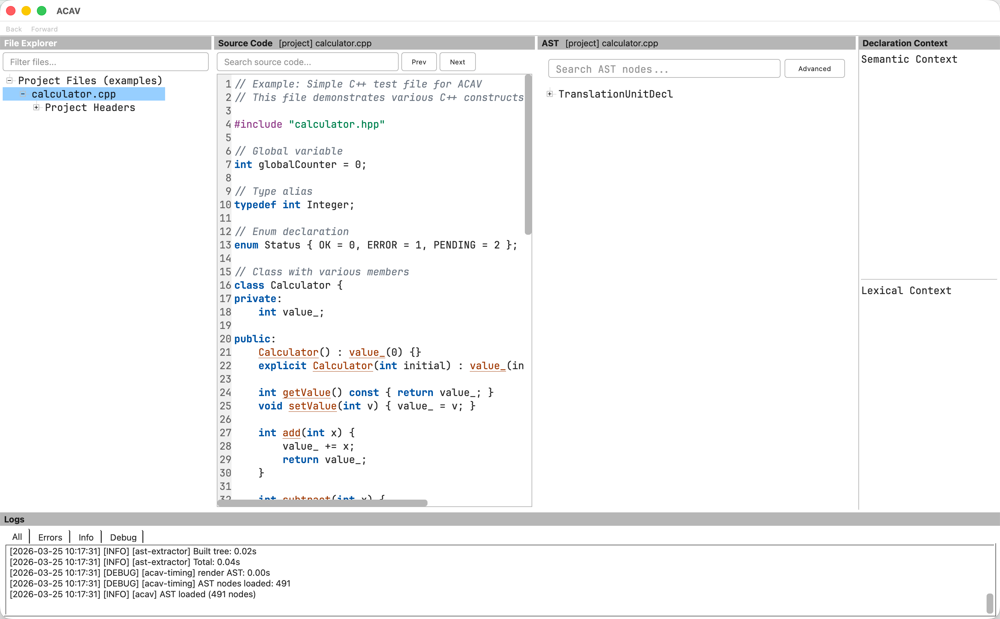
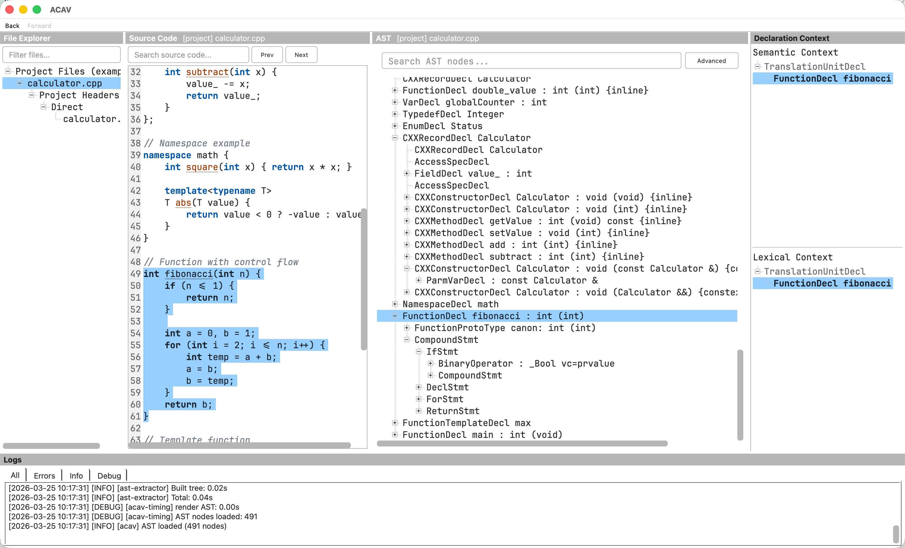
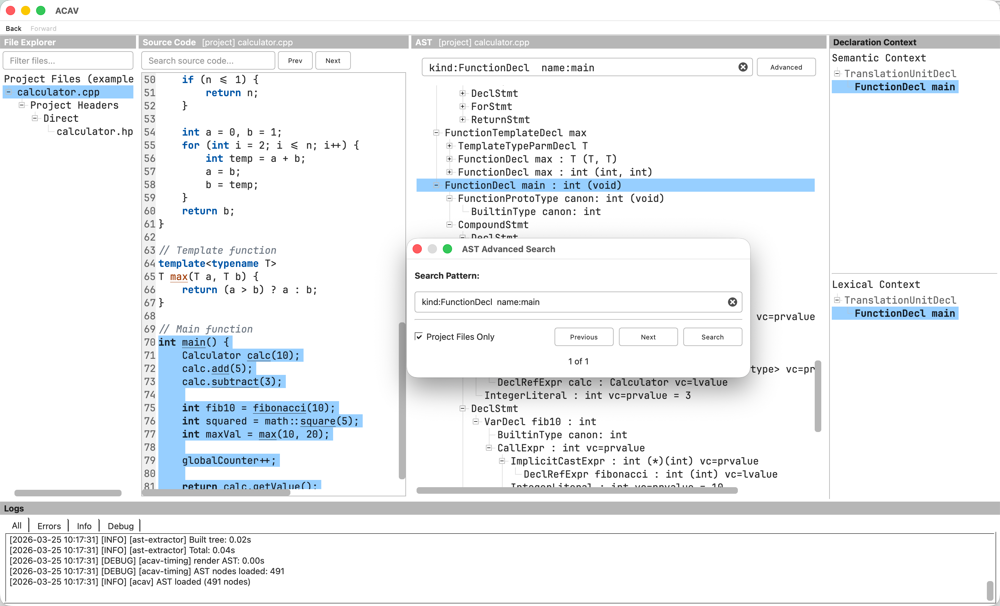
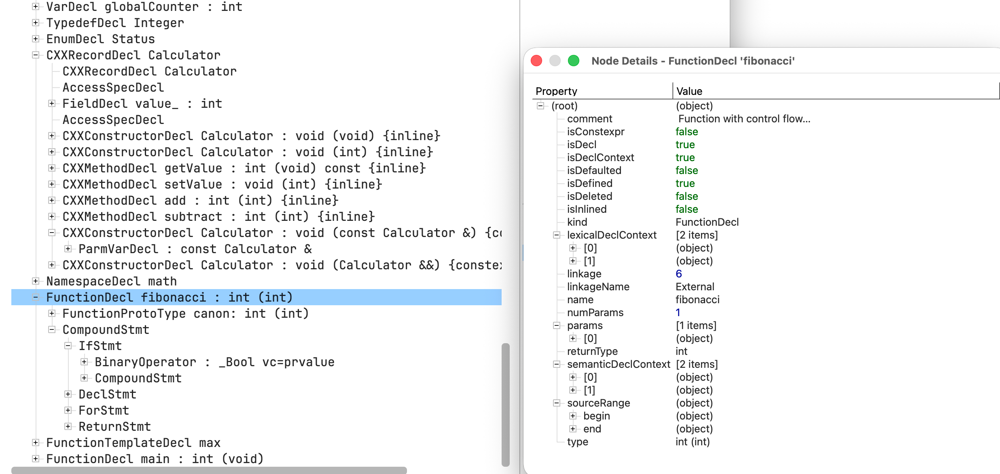

# User Manual {#user_manual}

**ACAV (Aurora Clang AST Viewer)** - Interactive Abstract Syntax Tree Visualization Tool

---

## Overview

ACAV is a graphical application that helps you explore and understand C, C++, and Objective-C code by visualizing its Abstract Syntax Tree (AST). It provides bidirectional navigation between source code and AST structure, making it easier to analyze how the compiler parses and interprets your programs.


*Screenshot: ACAV displaying the file explorer, source-code panel, AST tree
view, declaration-context panels, and log panel.*

---

## Supported Languages and Compilers

### Languages

ACAV targets Clang's C-family languages:
- **C** (all standards: C89, C99, C11, C17, C23)
- **C++** (all standards up to C++23)
- **Objective-C** and **Objective-C++**

### Compiler Compatibility

**In general, your project does NOT need to be built with Clang or the same LLVM version used by ACAV.** ACAV can analyze code from projects compiled with:
- **GCC** (when the compilation database uses Clang-compatible flags)
- **Clang**
- **Other compilers** when the compilation database is Clang-compatible

**Requirements:**
- A valid compilation database with Clang-compatible flags (JSON Compilation Database format, generated by CMake, Bear, intercept-build, or similar tools)
- Projects without C++20 modules or precompiled headers are broadly compatible across compiler toolchains
- Projects that use C++20 modules or PCH require matching Clang/LLVM versions between the project toolchain and ACAV

**Note:** Most C projects and many C++ projects work well with ACAV under the general compatibility model above.

---

## Key Features

### 1. AST Visualization
- Parse C, C++, and Objective-C source files and display their complete Abstract Syntax Tree
- Hierarchical tree view showing AST node structure
- Node details include: kind, type, name, and source location

### 2. File Explorer View
- Browse source files and included headers in a familiar tree-style panel
- Quickly filter the list to locate files in large projects
- Single-click to view source code; double-click to also load AST
- Context-aware expand/collapse via right-click menu

### 3. Bidirectional Navigation
- **AST to Code**: Click any AST node to highlight the corresponding source code
- **Code to AST**: Click in the source editor to jump to the most specific AST node at that location
- **Navigation History**: Use Back/Forward buttons (or Ctrl+[ / Ctrl+]) to navigate through your exploration history

### 4. Declaration Context Panel
- View the enclosing declaration hierarchy for any selected AST node
- Shows namespaces, classes, functions, and other declaration scopes
- Color-coded by declaration type (namespaces in green, classes in blue, functions in purple)
- Selected node is highlighted within the hierarchy
- Automatically updates when AST selection changes

### 5. Source Code Search
- Source editor includes lightweight C/C++ syntax highlighting (keywords, comments, strings/chars, function-like identifiers)
- Search for text within source files
- Navigate through search results with Prev/Next buttons
- Live highlighting of all matches

### 6. AST Node Search
- Search AST nodes by any property (kind, name, type, etc.)
- Quick search opens a floating popup with full controls
- Supports qualified search syntax: `kind:FunctionDecl name:main`
- Bare text searches across all node properties
- Case-insensitive regex matching
- Navigate through results with Prev/Next buttons and match counter
- Session query history with completer suggestions
- Optional "Project" filter to restrict results to project files (excluding system headers)

### 7. Region Selection in Source Code
- Drag to select a code range in the source editor
- Focus the AST view on the selected region for easier inspection

### 8. Export Functionality
- Export AST subtrees to JSON format
- Useful for further analysis or integration with other tools

### 9. File Path Display
- Source Code and AST panels display the current file path in their title bars
- Format: `[project] relative/path` for project files, `[external] /absolute/path` for external headers
- Long paths are elided in the middle with full path available in tooltip

### 10. Log Window
- View runtime messages and background task status
- Helpful for troubleshooting and performance monitoring

### 11. C++20 Modules Support (Conditional)
- Supports projects using C++20 named modules when the compiler versions match
- Resolves module paths correctly under compatible toolchains

### 12. AST Compilation Warning and Cache Recovery
- Shows an inline warning banner when compilation errors occurred and AST data may be incomplete
- If cached AST loading fails, ACAV automatically deletes stale cache and regenerates the AST
- Non-cache errors still report normally without silent retries

---

## Getting Started

### Opening a Project

**Method 1: Command Line**
```bash
acav -c /path/to/compile_commands.json
```

**Method 2: From GUI**
1. Launch ACAV
2. Go to **File → Open Compilation Database** (Ctrl+O)
3. Select your `compile_commands.json` file

### Understanding Compilation Databases

ACAV requires a **compilation database** (JSON Compilation Database format) that describes how each source file in your project is compiled. This file contains:
- Source file paths
- Compiler flags
- Include directories
- Other compilation settings

**How to generate a compilation database:**
- **CMake**: Add `-DCMAKE_EXPORT_COMPILE_COMMANDS=ON` to generate `compile_commands.json`
- **Bear**: Run `bear -- make` to intercept build commands and generate the database
- **intercept-build**: Part of Clang tools, works similarly to Bear
- **compiledb**: Python tool that can parse Makefiles

The file is typically named `compile_commands.json`, but ACAV accepts any valid JSON compilation database file.

---

## Command-Line Tools

ACAV ships three command-line executables. Most users interact primarily with
the `acav` GUI, which invokes the helper tools internally. The helper tools
can also be run directly for scripting, debugging, or preprocessing workflows.

### `acav`

Launches the Qt-based GUI for interactive AST exploration.

| Option | Description |
|--------|-------------|
| `-h`, `--help` | Display the built-in help text. |
| `-v`, `--version` | Print the ACAV version and exit. |
| `--config <path>` | Use a specific INI configuration file instead of the default `~/.acav`. |
| `-c`, `--compilation-database <path>` | Open a compilation database on startup. |
| `-p`, `--project-root <path>` | Override ACAV's automatically detected project root. |

**Common usage**

```bash
acav -c /path/to/compile_commands.json
```

```bash
acav --config /path/to/acav.ini
```

```bash
acav -c /path/to/compile_commands.json -p /path/to/project
```

### `query-dependencies`

Scans one or more translation units from a compilation database and writes a
JSON file describing header dependencies and related diagnostics.

| Option | Description |
|--------|-------------|
| `--compilation-database <path>` | Path to the JSON compilation database. Required. |
| `--output <path>` | Path to the output JSON file. Required. |
| `--source <path>` | Restrict processing to the specified source file. May be repeated. If omitted, all files in the compilation database are processed. |
| `--clang-resource-dir <path>` | Override the Clang resource directory used to locate builtin headers. |

**Example**

```bash
query-dependencies \
  --compilation-database compile_commands.json \
  --output dependencies.json
```

```bash
query-dependencies \
  --compilation-database compile_commands.json \
  --output dependencies.json \
  --source src/main.cpp \
  --source src/lib.cpp
```

### `make-ast`

Builds and serializes a Clang AST for one source file using the matching
compilation database entry.

| Option | Description |
|--------|-------------|
| `--compilation-database <path>` | Path to the JSON compilation database. Required. |
| `--source <path>` | Source file to parse. Required. |
| `--output <path>` | Output path for the serialized AST file. Required. |
| `--clang-resource-dir <path>` | Override the Clang resource directory used to locate builtin headers. |

**Example**

```bash
make-ast \
  --compilation-database compile_commands.json \
  --source /path/to/source.cpp \
  --output cache/source.ast
```

### How the Tools Fit Together

In a typical workflow:

1. `query-dependencies` extracts dependency information for a project or a
   selected subset of files.
2. `make-ast` generates a cached serialized AST for a source file.
3. `acav` lets you inspect the project interactively, or invokes these helper
   programs automatically in the background.

---

## Using the GUI

### Main Window Layout

The ACAV window is divided into four main panels, with an optional log window:

```
┌────────────────────────────────────────────────────────────────────┐
│  Menu Bar & Toolbar                                                │
├──────────────┬──────────────────┬───────────────┬─────────────────┤
│              │                  │               │  Declaration    │
│  File        │   Source Code    │  AST           │  Context Panel  │
│  Explorer    │   Editor         │  View         │                 │
│              │                  │               │                 │
├──────────────┴──────────────────┴───────────────┴─────────────────┤
│  Log Window (optional)                                            │
└────────────────────────────────────────────────────────────────────┘
```

**Left Panel**: File Explorer view of source files and included headers
**Center-Left Panel**: Source code editor with syntax highlighting
**Center-Right Panel**: Hierarchical AST tree structure for the selected file
**Right Panel**: Declaration context hierarchy for the selected AST node
**Bottom Panel**: Log window showing background tasks and runtime messages (optional)



*Screenshot: The ACAV main window with a sample project loaded, showing the
five dock panels.*

### Basic Workflow

1. **Select a Source File**
   - Use the File Explorer panel to browse source files and included headers
   - **Single-click** a file to view its source code
   - **Double-click** a file to view source code AND generate/load its AST

2. **Wait for AST Generation**
   - ACAV runs analysis in the background
   - Status messages appear in the status bar
   - First generation may take a few seconds; results are cached for future use
   - If a cached AST becomes stale, ACAV regenerates it automatically

3. **Explore the AST**
   - The right panel displays the hierarchical AST structure
   - Expand/collapse nodes using the triangle icons or **double-clicking**
   - Scroll through the tree to see different parts

4. **Navigate Between Code and AST**
   - Click an AST node → corresponding source code highlights
   - Click in source code → AST jumps to that location
   - Use Back/Forward to return to previous locations



*Screenshot: Bidirectional navigation between the source code and AST panels:
selecting source highlights the matching AST node and updates the declaration
context display.*

### File Explorer Interactions

The File Explorer uses a **two-action model** to separate browsing from AST generation:

| Action | Effect |
|--------|--------|
| **Single-click** | Changes active source file; displays source code in the editor |
| **Double-click** | Single-click effect + triggers AST extraction/loading |
| **F5** | Extract AST for the currently selected file |
| **Right-click** | Context menu with Expand All / Collapse All options |

**Why this design?** AST extraction can be expensive for large files. The two-action model lets you browse and read source code quickly without waiting for AST generation. When you're ready to analyze the AST, double-click or press F5.

**Example scenario:**
1. Double-click `main.cpp` → Source code loads, AST generates and displays
2. Single-click `utils.hpp` → Source code switches to utils.hpp, but AST still shows main.cpp
3. Double-click `utils.hpp` → AST now loads for utils.hpp
4. Single-click `main.cpp` → Source code switches back, AST still shows utils.hpp (cached)
5. Double-click `main.cpp` → AST reloads from cache (fast)

### Selecting a Code Region

1. Drag to select a region in the source editor
2. The AST view focuses on nodes that overlap the selection
3. Use this to narrow down large files and inspect specific sections

### Searching Source Code

1. Use the search box above the source editor
2. Type your search term
3. Press **Enter** or click **Next** to jump to matches
4. Use **Prev/Next** buttons to navigate results
5. All matches are highlighted in yellow

### Searching the AST

The AST panel includes a quick search field and a floating popup for finding nodes by their properties.

1. Focus the AST search field above the tree (or press **Ctrl+F** while the AST panel is focused) to open the popup
2. Type a search query using one of these formats:
   - **Bare text**: `foo` — searches across all node properties (kind, name, type, etc.)
   - **Qualified search**: `kind:FunctionDecl name:main` — matches specific properties
3. Press **Enter** or click **Search** to find matches
4. Use **Prev/Next** buttons to navigate through results
5. The status label shows your position (e.g., "3 of 15")
6. Reuse previous queries from history suggestions in the popup input

**Search syntax details:**
- Searches are **case-insensitive** and support **regular expressions**
- Bare text matches any property that *contains* the pattern
- Qualified values use **exact matching** (e.g., `name:main` matches "main" but not "remainder")
- Multiple qualifiers are combined with AND logic (all must match)
- **Shift+Enter** navigates to previous match; **Esc** closes the popup

**Project filter:** Enable the **Project** checkbox (on by default) to restrict results to project source files, excluding system and external headers.

**Examples:**
| Query | Finds |
|-------|-------|
| `main` | Any node with a property containing "main" |
| `name:main` | Nodes named exactly "main" |
| `kind:FunctionDecl` | All function declaration nodes |
| `kind:FunctionDecl name:main` | The function declaration named "main" |
| `kind:VarDecl type:int` | Variable declarations with type "int" |



*Screenshot: The AST search dialog, showing a qualified query, filtering to
project files only, and the matching `FunctionDecl` highlighted in the tree.*

### Viewing Node Details

To inspect detailed properties of an AST node:

1. Right-click on any AST node
2. Select **View Details...**
3. A dialog shows all node properties in a tree view (kind, type, source location, etc.)
4. For nodes with documentation comments, the `comment` property shows the associated comment text



*Screenshot: The Node Details dialog for a `FunctionDecl` node, showing
properties such as return type, linkage, and boolean attributes.*

### Exporting AST Data

To export an AST subtree:

1. Right-click on any AST node
2. Select **Export Subtree to JSON...**
3. Choose output location
4. The subtree (including all descendants) is saved as JSON

This is useful for:
- Programmatic AST analysis
- Comparing AST structures
- Documentation and debugging

### Log Window

The log window shows runtime messages and background task status. It is useful for:
- Diagnosing configuration or parsing errors
- Monitoring progress during AST generation
- Capturing timing or debug messages (if enabled)

---

## Keyboard Shortcuts

- For the full list, see **Help > Keyboard Shortcuts** in the application.

### Focus Switching
| Shortcut | Action |
|----------|--------|
| `Tab` | Cycle focus between panes |
| `Ctrl+1` | File Explorer |
| `Ctrl+2` | Source Code |
| `Ctrl+3` | AST |
| `Ctrl+4` | Declaration Context (Semantic) |
| `Ctrl+5` | Declaration Context (Lexical) |
| `Ctrl+6` | Logs |

### Source Code / AST View
| Shortcut | Action |
|----------|--------|
| `Home` | Go to start of file (Source Code) |
| `End` | Go to end of file (Source Code) |
| `Ctrl+F` | Focus search input (works in both Source Code and AST panels) |
| `Shift+Enter` | Previous AST search match (in AST search popup) |
| `Esc` | Close AST search popup |

### View
| Shortcut | Action |
|----------|--------|
| `Ctrl++` | Zoom in (focused panel only) |
| `Ctrl+-` | Zoom out (focused panel only) |
| `Ctrl+0` | Reset zoom (focused panel only) |

**Per-Panel Font Size:** Each panel (File Explorer, Source Code, AST, Declaration Context, Logs) maintains its own font size. Use `Ctrl++`/`Ctrl+-` to adjust only the currently focused panel.

### Tree Views (AST / File Explorer)
| Shortcut | Action |
|----------|--------|
| `Ctrl+Shift+E` | Expand all children of selected node |
| `Ctrl+Shift+C` | Collapse all children of selected node |
| `F5` | Extract AST for selected file |

**File Explorer Expand/Collapse:**

Right-click on a node in the File Explorer to access "Expand All" / "Collapse All" context menu options. At the directory level, expand/collapse operates on directories only (down to source files) to avoid accidentally loading massive header trees.

### Navigation History
| Shortcut | Action |
|----------|--------|
| `Ctrl+[` | Navigate back |
| `Ctrl+]` | Navigate forward |

### AST
| Shortcut | Action |
|----------|--------|
| `Ctrl+Shift+M` | Go to macro definition |
| `Ctrl+I` | Inspect node details |

### File
| Shortcut | Action |
|----------|--------|
| `Ctrl+O` | Open project |
| `Ctrl+Q` | Quit |
| `Ctrl+Shift+R` | Reload configuration |

---

## Settings

Access settings via **File → Open Config File...** (Ctrl+, or Cmd+, on macOS).
Use **File → Reload Configuration** to apply changes without restarting.

### Available Options

**Font Size** (`ui/fontSize`)
Adjust font size for tree views and source code editor (8-32 pt). Default: 11.

**Font Family** (`ui/fontFamily`)
Optional UI font family. Leave empty to use the system default.
Example: `fontFamily=JetBrains Mono`

**Cache Directory** (`cache/root`)
Location where AST files are stored for faster loading.
Default: `~/.cache/acav/`

**Comment Extraction** (`ast/commentExtraction`)
Extract and display documentation comments as properties on declaration nodes.
When enabled, comments are visible in the Node Details dialog. Default: true.

**Memory Profiling** (`debug/enableMemoryProfiling`)
Show peak memory usage at key processing points. Useful for debugging. Default: false.

**Parallel Processing** (`performance/parallelProcessorCount`)
Number of CPU cores to use for dependency analysis.
0 = auto-detect (use all available cores). Default: 0.

---

## Support

For issues, questions, or feedback, please use the repository issue tracker or contact the repository maintainers.
