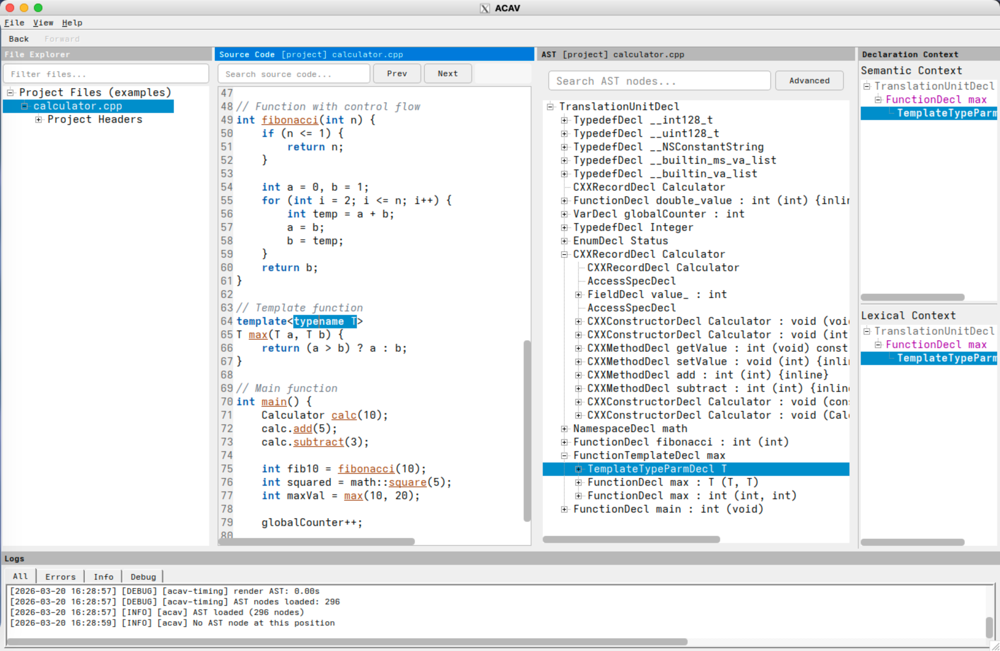

# ACAV

ACAV (Aurora Clang AST Viewer) is a desktop application for interactive
exploration of Clang abstract syntax trees in real C, C++, and Objective-C
projects. It helps users inspect how Clang represents source code, navigate
between source locations and AST nodes, and study program structure in projects
that provide a JSON compilation database.

For a broader project introduction, see the
[ACAV project website](https://uvic-aurora.github.io/acav/).

## Features

- Interactive AST visualization for Clang's C-family languages.
- Bidirectional navigation between source code and AST nodes.
- File explorer view for source files and included headers.
- Declaration-context view for namespaces, classes, functions, and other scopes.
- Source-code search, AST-node search, and region-based AST focusing.
- Background dependency analysis and AST generation through `query-dependencies`
  and `make-ast`.
- Automatic stale AST-cache recovery.
- JSON export for selected AST subtrees.
- Configurable GUI settings for cache location and display preferences.
- Native and containerized workflows for macOS and Linux.

## Demo Image

A prebuilt OCI demo image can be used with Docker or Podman to try ACAV before
building it locally. See the
[Docker/Podman demo image guide](DOCKER_IMAGE_README.md) for the detailed run
instructions. LLVM-specific release archives are available from the
[ACAV releases page](https://github.com/uvic-aurora/acav/releases).

## Documentation

The [online manual](https://uvic-aurora.github.io/acav-manual/index.html) is
the main documentation source for ACAV. It covers the GUI, command-line tools,
source/API documentation, installation, usage, features, configuration, release
notes, and related project resources.

For repository-local installation instructions, see [INSTALL.txt](INSTALL.txt).

## License

License terms are provided in [LICENSE.txt](LICENSE.txt). Project attribution
and copyright context are provided in [NOTICE.txt](NOTICE.txt).
